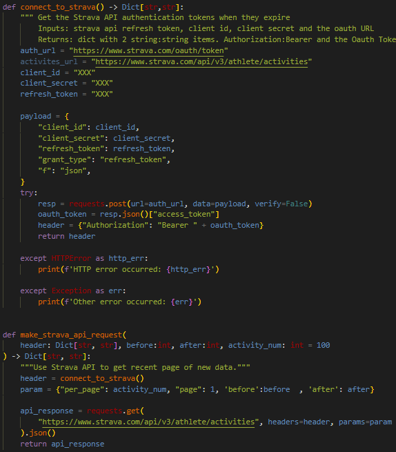
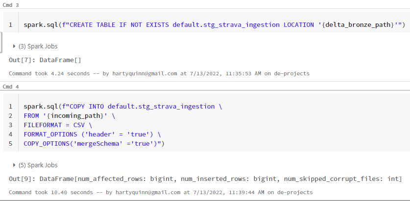
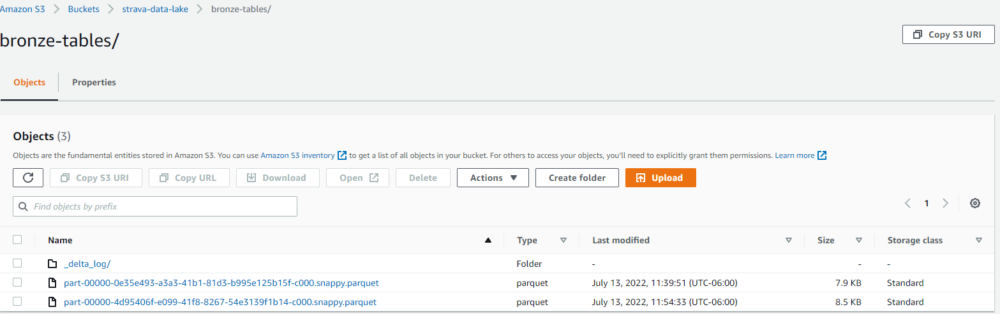

# Strava Lakehouse

# Introduction & Goals
In this project, I have created a data pipeline to ingest data from the Strava API to a Lakehouse in Databricks on S3. This project is meant to demonstrate my ability to create a succesful idempotent end-to-end data pipeline. 
- This data pipeline ingests monthly strava activity data into a lakehouse on S3. This pipeline runs once a month. 
  - Data: Strava API activity data
  - Tools: Python, SparkSQL, Airflow, S3
    - These tools are used to create a batch ingestion pipeline to my lakehouse on S3

# Contents

- [The Data Set](#the-data-set)
- [Tooling](#tooling)
- [Pipeline](#pipeline)
  - [Connect](#connect)
  - [Buffer](#buffer)
  - [Processing](#processing)
  - [Storage](#storage)
- [Conclusion](#conclusion)
- [Appendix](#appendix)

# The Data Set
This data is 4 years worth of activities from the [Strava API](https://developers.strava.com/). I chose this data because it allowed me to work with an API. Since it is athlete generated data, there are a lot of numeric fields to work with to generate useful analytics performance metrics for month-to-month comparisons. 

The downside is there are only 600 possible rows for the dataset so I am working with tiny data. One possible solution could be to use the popular [Divvy bikes](https://divvy-tripdata.s3.amazonaws.com/index.html) dataset or the [NYC TLC Taxi](https://www1.nyc.gov/site/tlc/about/tlc-trip-record-data.page) datasets to increase the number of events I am processing in the lakehouse. 

# Tooling
The tools I used for this project are overkill! I chose these tools because they are extremely popular within the data engineering field and I was interested in learning them. 

The tools are as follows:
- Python
    - Besides SQL this is the first language I learned and is extremely readable. I am by no means an advanced programmer, so having a simple, readable codebase is necessary for me and those who look at this project. 
- Airflow
    - Since it is the most popular workflow manager I figured I would use it for learning's sake. 
    - It is possible to write dags pythonically with Airflow 2.0's TaskFlow API
- AWS S3
    - Most commonly used cloud object storage. 
- Databricks & Delta Lake
    - This seemed like a great way to get into learning spark without spinning up local clusters on docker. 
    - If I were to use a larger dataset like the two mentioned above, I could mimic a streaming pipeline with spark streaming as well! 

# Pipeline
## Connect
We connect to the Strava API and retrieve 1 month's worth of activity data in JSON format, which is a list of JSON dictionaries. We then extract the needed data with key:value pairs in the JSON dictionary for each individual activity. We save each activity in a list of lists, which we write to a .csv file. 

## Buffer
Landing zone in our S3 bucket for .csv files. 
## Processing
Data is processed in batches with Databricks Spark SQL. AFter the data is uploaded to S3, the Databricks Job starts and processes the activities, I have included the notebook here. The processing framework is quite simple, and we only use COPY INTO and INSERT INTO for the bronze and silver lakehouse tables. 

## Storage
Data is stored in different folders in S3 depending on whether it is a bronze or silver table. These folders store the data in parquet format and have a delta log, making the storage solution a delta lake! 

# Next Steps 
- Adding unit tests to my python functions (json schema validation)
- Creating a concurrent spark streaming architecture 
- Partitioning my Delta Lake tables by ingestion date
- Data quality checks

# Appendix

[Markdown Cheat Sheet](https://github.com/adam-p/markdown-here/wiki/Markdown-Cheatsheet)